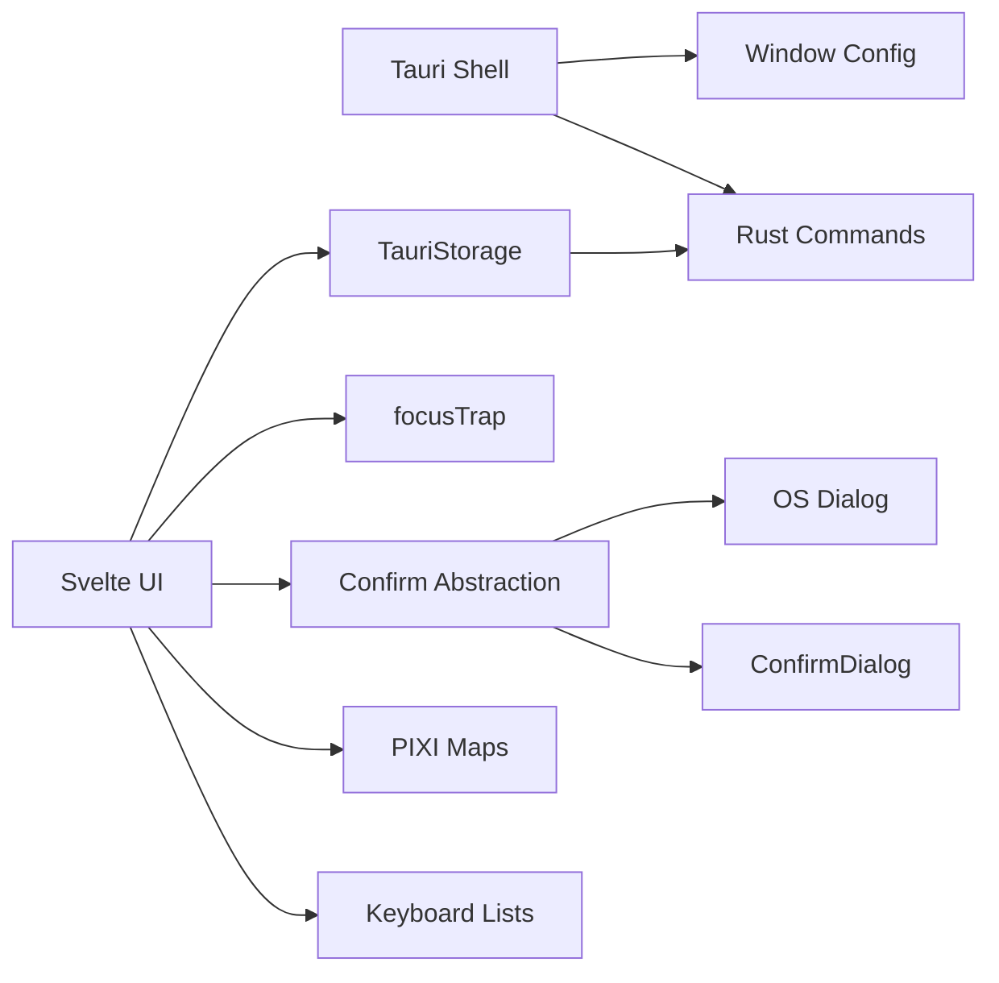

# Audit Findings

### Audit Context

I audited the Tauri shell, frontend component flow, keyboard/focus handling, storage IPC, and existing tests. No concrete user-feedback text was present in the issue body beyond the UX objectives, and `.junie/memory/feedback.md` is empty, so the priorities below are based on observable UX risks in the current implementation.

### Prioritized Issues

#### P0 — Desktop window opens too small for the current UI density

- **Problem:** The app starts at `800x600`, while the UI uses a fixed top navigation, left system panel, right inspector, bottom labels, search dropdowns, and full-screen PIXI canvases. This creates a cramped first-run desktop experience and increases overlap risk.
- **Root cause:** `apps/shell/tauri.conf.json` defines only `width: 800` and `height: 600` for the main window, with no `minWidth`, `minHeight`, or centering.
- **Proposed fix:** Update the Tauri window defaults to a more desktop-friendly size and minimum size, e.g. `1200x800` default with `900x650` minimum and `center: true`.
- **Breaking-change callout:** This changes startup window behavior but does not break Tauri APIs, data storage, or IPC contracts.

#### P0 — Modal and panel focus behavior is inconsistent

- **Problem:** Dialogs are focus-trapped, but initial focus lands on the dialog container instead of the useful control. Inspector editing requires an extra Tab/click, and modal semantics are inconsistent.
- **Root cause:** `apps/client/src/lib/actions/focusTrap.ts` focuses the container whenever it has `tabindex`; `Inspector.svelte` uses the action on a `tabindex="-1"` dialog, so the `#name` input is not focused despite prior UX plans expecting it. `Inspector.svelte` also uses `role="dialog"` without `aria-modal`.
- **Proposed fix:** Enhance `focusTrap` to prefer `[data-autofocus]`, `[autofocus]`, or the first focusable descendant before falling back to the container; mark the Inspector name input as the autofocus target; add `aria-modal="true"` where the panel behaves modally.

#### P1 — Destructive regenerate flow should use native desktop confirmation when available

- **Problem:** The app uses a custom `ConfirmDialog` for replacing the current cluster. In Tauri desktop, this should preferably be an OS-native confirmation dialog to match platform expectations and avoid custom modal/focus conflicts.
- **Root cause:** `Navigation.svelte` controls `showRegenerateConfirm` and renders `ConfirmDialog`; `apps/shell/Cargo.toml` currently includes only `tauri-plugin-opener`, and `apps/shell/capabilities/default.json` does not grant dialog permissions.
- **Proposed fix:** Add a small confirmation abstraction in the frontend that uses Tauri's native dialog plugin when `window.__TAURI_INTERNALS__` is present and falls back to the existing `ConfirmDialog` on the web target.
- **Dependency/config callout:** This requires adding `tauri-plugin-dialog` / `@tauri-apps/plugin-dialog` and updating Tauri capabilities. This is not breaking, but it is a new dependency and permission change.

#### P1 — Search combobox ARIA is incomplete

- **Problem:** Keyboard navigation works, but screen-reader users do not get a fully connected combobox/listbox relationship: there is no stable `aria-activedescendant`, no `aria-autocomplete`, and options do not have IDs.
- **Root cause:** `Navigation.svelte` defines `role="combobox"`, `aria-expanded`, and `aria-controls`, while result buttons use `role="option"`, but active option state is only visual and `aria-selected`.
- **Proposed fix:** Add stable option IDs, set `aria-activedescendant` on the input, add `aria-autocomplete="list"`, and ensure the no-results state is announced politely.

#### P1 — Canvas-only interactions need stronger keyboard parity cues

- **Problem:** The maps are PIXI canvas interactions (`StarMap.svelte`, `SolarSystemMap.svelte`). `SystemList.svelte` and `Announcer.svelte` provide useful accessibility alternatives, but in-system body selection is still pointer-first.
- **Root cause:** `SystemList.svelte` only lists systems in cluster view; `SolarSystemMap.svelte` exposes body/star selection through PIXI pointer events; the help overlay documents pointer actions but not an equivalent list/detail path for bodies.
- **Proposed fix:** Add a compact, collapsible “System Objects” panel in system view that lists stars and orbital bodies, allowing keyboard users to select objects and open the same `Inspector` path without canvas interaction.

#### P2 — Duplicate “Back to Cluster” controls create inconsistent navigation semantics

- **Problem:** System view has both the global navigation back button and a map-local “Back to Cluster” button, with slightly different state handling.
- **Root cause:** `Navigation.svelte` has `goBack()`/`goToCluster()` that clears selection and active system; `SolarSystemMap.svelte` directly sets `viewMode` to `cluster` without also clearing `activeSystemId` or `selectedEntity`.
- **Proposed fix:** Reuse the same state transition semantics for all back controls, either via a small shared helper in `appState.ts` or by updating the map-local button handler to clear the related stores.

#### P2 — Desktop shell lacks native menu/tray affordances

- **Problem:** The Tauri shell has no native menu or tray setup, so users lack platform-standard commands such as About, Quit, keyboard shortcut discovery, and potentially show/hide window affordances.
- **Root cause:** `apps/shell/src/lib.rs` only initializes state, opener plugin, and invoke handlers; no `MenuBuilder`, `TrayIconBuilder`, or window lifecycle hooks are configured. `apps/shell/Cargo.toml` has `tauri` features set to `[]`.
- **Proposed fix:** Keep this out of the first implementation slice unless explicitly desired. If included later, add a native app menu first; tray/close-to-tray should be a separate product decision because it changes window lifecycle expectations.
- **Breaking-change callout:** Close-to-tray would be a behavior change and should be approved separately before implementation.

# Requirements

### Overview & Goals

Improve the Tauri desktop app’s UX with minimal, targeted changes based on the audit, preserving the existing Svelte 5 + Tauri + PIXI architecture.

### In Scope

- Improve first-run desktop window sizing.
- Fix modal/focus behavior for Inspector, Help, and confirmation flows.
- Improve search combobox accessibility without changing search behavior.
- Add keyboard-accessible selection for in-system objects if implementation budget allows.
- Prefer native Tauri dialogs for destructive desktop confirmations, while keeping web compatibility.
- Preserve existing map performance by avoiding extra IPC calls during hover/zoom/pan interactions.
- Add/update tests before or alongside each behavioral change following the project’s TDD expectations.

### Out of Scope

- Replacing PIXI rendering, Svelte, SvelteKit, or Tauri.
- Reworking procedural generation or storage formats.
- Changing cluster data models or Rust command contracts unless native dialog plugin setup requires capability changes.
- Implementing tray/close-to-tray behavior without explicit follow-up approval.

### Acceptance Criteria

- Desktop launches at a comfortable default size with reasonable minimum dimensions.
- Opening the Inspector focuses the name field and keeps keyboard navigation contained until it closes.
- Help and confirmation dialogs retain accessible modal behavior and restore focus to their triggers.
- Desktop regenerate confirmation uses the native OS dialog when running in Tauri, with the current custom dialog retained as browser fallback.
- Search results expose active item state to assistive technology during arrow-key navigation.
- System view has a keyboard-accessible way to select celestial bodies without using the canvas.
- Existing cluster load/save/generate/route IPC behavior remains compatible.

# Technical Design

### Current Implementation

- **Shell:** `apps/shell/src/lib.rs` creates a Tauri app with `AppState`, `tauri_plugin_opener`, and command handlers from `commands.rs`.
- **Window config:** `apps/shell/tauri.conf.json` defines one main window at `800x600`.
- **Storage IPC:** `apps/client/src/lib/storage/tauri.ts` dynamically imports `@tauri-apps/api/core` and invokes `get_cluster`, `save_cluster`, `generate_cluster`, and `find_portal_route`; Rust handlers live in `apps/shell/src/commands.rs`.
- **Main UI flow:** `apps/client/src/routes/+page.svelte` loads WASM/storage, then renders `Navigation`, `StarMap`, `SolarSystemMap`, `Inspector`, `HelpOverlay`, `SystemList`, `Announcer`, and `Toast`.
- **Keyboard shortcuts:** `+layout.svelte` delegates to pure `resolveShortcut()` in `apps/client/src/lib/actions/shortcuts.ts`.
- **Maps:** `StarMap.svelte` and `SolarSystemMap.svelte` own PIXI scene setup and pointer interactions. Existing accessibility support includes `SystemList.svelte` and `Announcer.svelte`.
- **Testing:** Component tests already exist next to Svelte components with Vitest and Testing Library; e2e coverage exists under `apps/e2e-tests/test/specs/`.

### Key Decisions

- **Use targeted UX fixes first:** Avoid broad refactors; change only the affected components/config.
- **Keep IPC stable:** Do not change existing Rust command names or payloads.
- **Use native desktop dialog only behind a thin abstraction:** Tauri desktop uses `@tauri-apps/plugin-dialog`; browser/web tests keep the current `ConfirmDialog` fallback.
- **Keep canvas rendering imperative:** Accessibility improvements should sit alongside the canvas rather than forcing DOM rendering of map graphics.
- **Avoid tray lifecycle changes in this pass:** A native menu/tray can be planned later; close-to-tray is explicitly not part of this implementation because it changes app lifecycle expectations.

### Proposed Changes

#### Tauri window sizing

- Modify `apps/shell/tauri.conf.json` main window object:
  - `width`: `1200`
  - `height`: `800`
  - `minWidth`: `900`
  - `minHeight`: `650`
  - `center`: `true`

#### Focus management

- Update `apps/client/src/lib/actions/focusTrap.ts`:
  - Prefer `[data-autofocus]`, `[autofocus]`, or the first focusable element.
  - Fall back to the container only when there is no focusable child.
  - Keep previous focus restoration behavior.
- Update `Inspector.svelte`:
  - Add `aria-modal="true"`.
  - Mark `#name` with `data-autofocus`.
- Verify `HelpOverlay.svelte` and `ConfirmDialog.svelte` still get sensible first focus and focus restoration.

#### Native confirmation abstraction

Add a small frontend helper, for example `apps/client/src/lib/platform/confirm.ts`:

```ts
export interface ConfirmOptions {
  title: string;
  message: string;
  confirmLabel: string;
  cancelLabel: string;
  kind?: 'warning' | 'info' | 'error';
}

export async function nativeConfirm(options: ConfirmOptions): Promise<boolean | null>;
```

- Return `true`/`false` when a Tauri-native confirmation is available.
- Return `null` when the browser fallback UI should be shown.
- Add Tauri dialog dependencies and capability permissions if this stage is approved.
- Keep `ConfirmDialog.svelte` as the browser fallback and as a testable non-Tauri path.

#### Search combobox accessibility

- Update `Navigation.svelte`:
  - Add `aria-autocomplete="list"` to the input.
  - Add `aria-activedescendant` when results are open.
  - Give each result a deterministic ID like `search-result-${result.type}-${result.id}`.
  - Add a polite announcement for no-results text if needed.

#### System object keyboard selection

- Add or extend a component such as `SystemList.svelte` / new `SystemObjectList.svelte`:
  - Render in system view near the existing top-left controls.
  - Flatten `systemData.Stars`, star satellites, top-level bodies, and nested satellites.
  - Use buttons with clear labels (`Star`, `Planet`, `Moon`, etc.) to set `selectedEntity`.
  - Keep it collapsible to avoid obscuring the map.

#### Navigation state consistency

- Either add a helper in `apps/client/src/lib/stores/appState.ts`:

```ts
export function goToClusterView(): void {
  selectedEntity.set(null);
  activeSystemId.set(null);
  viewMode.set('cluster');
}
```

- Or update `SolarSystemMap.svelte`’s local back button to clear `selectedEntity` and `activeSystemId` directly.

### Architecture Diagram



### Risks & Mitigations

- **New Tauri dialog dependency:** Keep it isolated; update capabilities explicitly; retain browser fallback.
- **Focus-trap regressions:** Add unit tests for initial focus, Tab wrapping, and focus restore.
- **Search ARIA regressions:** Extend existing `Navigation.test.ts` instead of creating a parallel test strategy.
- **System object list crowding:** Make it collapsible and place it consistently with existing fixed `top-20` UI patterns from `.junie/STATE.md`.

# Testing

### Validation Approach

Follow the project’s Red-Green-Refactor workflow with targeted tests around changed behavior.

### Unit / Component Tests

- `apps/client/src/lib/actions/focusTrap.test.ts`
  - Add a failing test proving `[data-autofocus]` or first focusable child receives focus on mount.
  - Verify focus is restored on destroy.
- `apps/client/src/lib/components/Inspector.test.ts`
  - Verify opening Inspector focuses the name input.
  - Verify `aria-modal="true"` is present.
- `apps/client/src/lib/components/Navigation.test.ts`
  - Verify search input exposes `aria-autocomplete` and `aria-activedescendant` during keyboard navigation.
  - Verify native-confirm path calls the helper and fallback path still opens `ConfirmDialog`.
- New/updated system object list test
  - Verify stars/bodies render as keyboard-selectable buttons.
  - Verify clicking/activating an item sets `selectedEntity`.

### Rust / Tauri Validation

- If adding `tauri-plugin-dialog`, validate `apps/shell/Cargo.toml`, `apps/shell/src/lib.rs`, and `apps/shell/capabilities/default.json` compile together.
- Existing Rust storage tests in `apps/shell/src/storage.rs` should remain unchanged and green.

### E2E / Regression Scenarios

- Existing `navigation-flow.e2e.js` should still pass for search, back navigation, help overlay, and Inspector save.
- Add or update an e2e scenario for keyboard-accessible object selection only if the new object list is implemented in this pass.

### Commands to Run

- `pnpm nx test horizonis-client`
- `pnpm nx test horizonis-shell`
- `pnpm nx run-many --targets=check`
- `pnpm lint`
- If practical in the environment: `pnpm e2e:web` and `pnpm e2e:desktop`

# Delivery Steps

### ✓ Step 1: Fix desktop launch sizing and navigation state consistency
The desktop window opens at a usable size and all back-to-cluster paths clear related state consistently.

- Update the main window dimensions in `apps/shell/tauri.conf.json` with larger defaults, minimum dimensions, and centering.
- Update `SolarSystemMap.svelte`’s map-local back control to clear `selectedEntity` and `activeSystemId`, matching `Navigation.svelte` semantics.
- Add or update focused tests where practical for the shared navigation-state behavior.

### ✓ Step 2: Harden focus management for modal and panel interactions
Inspector and dialogs move focus to the most useful control, trap focus, and restore focus predictably.

- Add failing tests for desired `focusTrap` initial-focus behavior in `focusTrap.test.ts`.
- Update `focusTrap.ts` to prefer `[data-autofocus]`, `[autofocus]`, or the first focusable child before falling back to the container.
- Mark the Inspector name input in `Inspector.svelte` as the autofocus target and add missing modal semantics.
- Extend `Inspector.test.ts` to cover initial focus and modal attributes.

### ✓ Step 3: Add native desktop confirmation with web fallback
Regenerating a cluster uses an OS-native confirmation in Tauri and keeps the current custom dialog fallback for web.

- Add the Tauri dialog plugin dependencies and required capability permission after confirming the dependency/config change is acceptable.
- Initialize the Rust dialog plugin in `apps/shell/src/lib.rs`.
- Add a small frontend confirmation helper that returns `null` when native confirmation is unavailable.
- Update `Navigation.svelte` so the regenerate action uses the native helper on desktop and `ConfirmDialog` fallback in browser.
- Extend `Navigation.test.ts` to cover both native-confirm and fallback-confirm flows.

### ✓ Step 4: Improve search combobox accessibility
Search results expose the active result and list relationship correctly to assistive technologies.

- Update `Navigation.svelte` with `aria-autocomplete`, deterministic option IDs, and `aria-activedescendant`.
- Ensure arrow-key navigation keeps visual and ARIA active states synchronized.
- Add a polite no-results announcement if needed.
- Extend existing Navigation component tests for the new ARIA contract.

### ✓ Step 5: Add keyboard-accessible system object selection
Users can select stars and orbital bodies in system view without interacting with the PIXI canvas.

- Add a collapsible system-object list component or extend `SystemList.svelte` for system view.
- Flatten stars, top-level bodies, and nested satellites into keyboard-operable buttons.
- Wire item activation to `selectedEntity.set(...)`, reusing the existing `Inspector` flow.
- Add component tests for rendering, nested-object labels, and selection behavior.
- Run the project validation commands and delegate a final code review/changelog update during implementation.