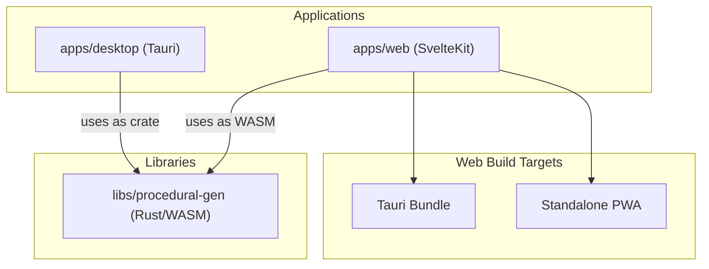

# Requirements

### Overview & Goals
Extract the procedural generation logic and data models into a shared library to allow its use in both the Rust-based desktop app and the Svelte-based web app (via WASM). This enables the web app to function as a standalone Progressive Web App (PWA) with the same generation capabilities as the desktop version.

### Scope
- **In Scope**:
    - Extraction of `models.rs` and `generation.rs` to `libs/procedural-gen`.
    - Extraction of `compute_route` logic from `commands.rs` to `libs/procedural-gen` to enable pathfinding in PWA.
    - Implementation of seed-based generation to ensure WASM/Desktop parity.
    - WASM binding generation for the extracted logic (generation and routing).
    - Integration of WASM into `@apps/web`.
    - Svelte 5 modernization of core components (Runes, Events).
    - Web performance optimizations (spatial indexing, O(1) lookups, debouncing).
    - Security gating for debug globals in `@apps/web`.
    - PWA configuration for `@apps/web`.
    - Abstraction of persistence in the web app to support both Tauri and Standalone modes.
    - Refactoring of desktop storage to use atomic writes.
- **Out of Scope**:
    - Changes to the core generation algorithms.
    - New UI features for the web or desktop apps.
    - Backend server implementation (PWA will rely on local storage).

# Technical Design

### Current Implementation
- **Desktop**: Rust Tauri app in `apps/desktop`. Generation logic is embedded in the desktop app's crate.
- **Web**: SvelteKit app in `apps/web`. Currently relies on Tauri `invoke` calls to get/save cluster data.
- **Models**: Shared manually via TypeScript definitions in `apps/web/src/lib/types/stellar.ts`.

### Key Decisions
- **WASM Interop**: Use `wasm-bindgen` and `serde-wasm-bindgen` for efficient data transfer between Rust and JavaScript.
- **WASM Build Tool**: Use `wasm-pack` to build the library for the web target.
- **RNG Strategy**: Replace `ThreadRng` with `impl Rng` in generation functions and use `StdRng` with explicit seeds to ensure WASM compatibility and deterministic results across platforms.
- **Routing**: Move pathfinding logic to the shared library. Use `petgraph` in the shared library and ensure it compiles to WASM.
- **Persistence Abstraction**: Use a strategy pattern in `@apps/web` to detect the environment (Tauri vs. Web) and choose the appropriate storage provider (Tauri API vs. Browser LocalStorage).
    - **Interface Contract**:
      ```typescript
      export interface StorageProvider {
          getCluster(): Promise<StarCluster>;
          saveCluster(cluster: StarCluster): Promise<void>;
      }
      ```
- **Library Build Configuration**: Use a Cargo feature (e.g., `wasm`) to conditionally enable the `cdylib` crate type. This prevents linker conflicts when building the desktop app (which uses `rlib`/`staticlib`) while allowing `wasm-pack` to produce the necessary WASM binary.
- **Svelte 5 Modernization**: Standardize on Svelte 5 runes (`$props`, `$derived`, `$state`) and new event syntax (`onclick`, `onkeydown`) to replace deprecated Svelte 4 patterns.
- **Web Performance Strategy**:
    - Use spatial indexing (e.g., grid-based) in `StarMap` for O(log n) closest-system lookups.
    - Use `Map` for O(1) entity lookups by ID during rendering and inspector updates.
    - Implement debouncing for search input in `Navigation`.
    - Use `structuredClone()` for deep copies to maintain type integrity and performance.
- **Security & Debugging**: Gate all `window` debug extensions (stores, starMapDebug) behind `import.meta.env.DEV` to prevent state exposure in production.
- **Atomic Storage**: Refactor desktop storage to use a write-to-temp-and-rename pattern to prevent data corruption.
- **PWA Implementation**: Use `vite-plugin-pwa` for SvelteKit to handle service workers and manifest generation.

### Proposed Changes
1.  **New Library**: `libs/procedural-gen`
    - Crate type: `rlib` and conditionally `cdylib` (via `wasm` feature).
    - Dependencies: `serde`, `uuid` (with `js` feature), `rand`, `delaunator`, `petgraph`.
    - `src/lib.rs`: Re-exports models and generation functions.
    - `src/models.rs`: Core data structures.
    - `src/generation.rs`: Seed-based generation logic (`generate_cluster(seed: u64)`), optimized edge deduplication using `HashSet`.
    - `src/routing.rs`: Pathfinding logic extracted from `commands.rs`.
    - `src/wasm.rs`: WASM-specific entry points and JS-friendly wrappers for generation and routing.
2.  **Desktop App Updates**:
    - Replace internal `models` and `generation` modules with `use procedural_gen::...` imports.
    - Update `Cargo.toml` to include the library as a dependency.
    - Refactor `storage.rs` for atomic writes, better error propagation, and update `create_default_cluster` to use the new library's API.
    - Improve startup reliability by logging errors before panicking in `lib.rs`.
3.  **Web App Updates**:
    - Add the WASM package as a dependency in `package.json`.
    - Migrate `Inspector`, `Navigation`, and `StarMap` to Svelte 5 (Runes, new event syntax).
    - Fix memory leak in `Inspector` by replacing manual `subscribe` with reactive store access.
    - Optimize `StarMap` performance: pre-calculate `worldWidth`/`worldHeight`, implement spatial indexing, and cache `hitArea` objects.
    - Refactor `clusterData.ts` to use the `StorageProvider` abstraction and improve error state handling in `+page.svelte`.
    - Use dynamic imports for `@tauri-apps/api` to allow the PWA to run outside of Tauri without bundle errors.
    - Configure Vite with `vite-plugin-pwa` and make Tauri-specific server settings (like `strictPort`) conditional.
    - Gate debug globals behind environment checks.

### Architecture Diagram


### File Structure
- `libs/procedural-gen/`
    - `Cargo.toml`
    - `src/`
        - `lib.rs`
        - `models.rs`
        - `generation.rs`
        - `wasm.rs`
- `apps/web/`
    - `src/lib/storage/` (new)
        - `index.ts`
        - `tauri.ts`
        - `browser.ts`

# Testing

### Validation Approach
- **WASM Consistency**: Compare output of `generate_cluster` and `compute_route` in Rust (Desktop) and WASM (Web) using the same seed to ensure parity.
- **Persistence**: Verify that data saved in PWA mode persists across page reloads using LocalStorage.
- **Tauri Integration**: Verify that `@apps/web` still correctly communicates with the Tauri backend when running inside the desktop app.
- **Atomic Writes**: Verify that desktop storage remains intact even if a save operation is interrupted (by mocking/simulating failure).
- **Unit Testing**: Refactor `clusterData.test.ts` to inject mock providers and cover error paths for both Tauri and Browser storage.

### Key Scenarios
1.  **Desktop Launch**: Application starts, loads cluster from disk using the new library.
2.  **Web Standalone**: User visits the site as a PWA, triggers generation (WASM), and the cluster is saved to LocalStorage.
3.  **Offline PWA**: User disconnects from internet, reloads PWA, and can still view/interact with the saved cluster.

# Delivery Steps

###   Step 1: Extract procedural generation and routing to shared library
Extract logic, models, and pathfinding into a new Rust library and update desktop integration.

- Create `libs/procedural-gen` directory and `Cargo.toml`.
- Move `models.rs`, `generation.rs` from `apps/desktop` to the new library.
- Move `compute_route` logic from `commands.rs` to `routing.rs` in the new library.
- Add `delaunator` and `petgraph` as dependencies to the new library.
- Refactor `generation.rs` to use `generate_cluster(seed: u64)`, `impl Rng`, and `HashSet` for edge deduplication.
- Deduplicate portal edges in `compute_route` for undirected graph efficiency.
- Fix star generation bugs (trinary star distances) and unify naming (Asteroid Belt).
- Expand system name pool to support more than 20 systems without fallback.
- Update `apps/desktop/src/lib.rs`: replace internal modules with library imports and add startup error logging.
- Update `apps/desktop/src/storage.rs`: use new library's API in `create_default_cluster`.
- Add the new library to the root `Cargo.toml` workspace.

###   Step 2: Implement WASM support and build configuration
Enable WASM compilation with proper gating and platform consistency.

- Add `wasm-bindgen` and `serde-wasm-bindgen` dependencies.
- Configure `Cargo.toml` to cfg-gate `cdylib` crate type behind a `wasm` feature.
- Enable `js` features for `uuid` (v4) and `getrandom` (via `rand` features) to ensure WASM compatibility.
- Implement `#[wasm_bindgen]` wrappers for `generate_cluster(seed: u64)` and `compute_route`.
- Add a `wasm-pack` build script to the library's `project.json`.

###   Step 3: Modernize Web App and integrate WASM
Improve desktop reliability, modernize the web UI, and integrate WASM with abstraction.

- Refactor `apps/desktop/src/storage.rs` to use atomic writes (temp file + rename) and propagate errors.
- Add the generated WASM package to `apps/web/package.json`.
- Create a `StorageProvider` interface in `apps/web/src/lib/storage`.
- Refactor `apps/web/src/lib/stores/clusterData.ts` to use the storage abstraction and handle async WASM init.
- Migrate `Inspector.svelte`, `Navigation.svelte`, and `StarMap.svelte` to Svelte 5 syntax and fix memory leaks.
- Implement performance optimizations: `structuredClone`, spatial indexing in `StarMap`, and debounced search.
- Implement dynamic imports for `@tauri-apps/api` in the `TauriStorage` implementation.
- Gate debug globals (`window.stores`, `window.starMapDebug`) behind `import.meta.env.DEV`.
- Update `+page.svelte` to include explicit error states for failed initialization.
- Refactor `clusterData.test.ts` to use mock providers and cover error paths.
- Ensure TypeScript types in `@apps/web` match the `PascalCase` serialization from Rust.

###   Step 4: Implement PWA support and build targets
Enable PWA features and add a separate build target with conditional configuration.

- Add `vite-plugin-pwa` to `apps/web` devDependencies.
- Configure `vite-plugin-pwa` in `apps/web/vite.config.js`.
- Make Tauri-specific Vite server options (`strictPort`, fixed port) conditional or move to a separate config.
- Create a web manifest and add PWA icons to `static/`.
- Register the service worker in SvelteKit.
- Add a `pwa:build` target to `apps/web/project.json` for standalone deployment.