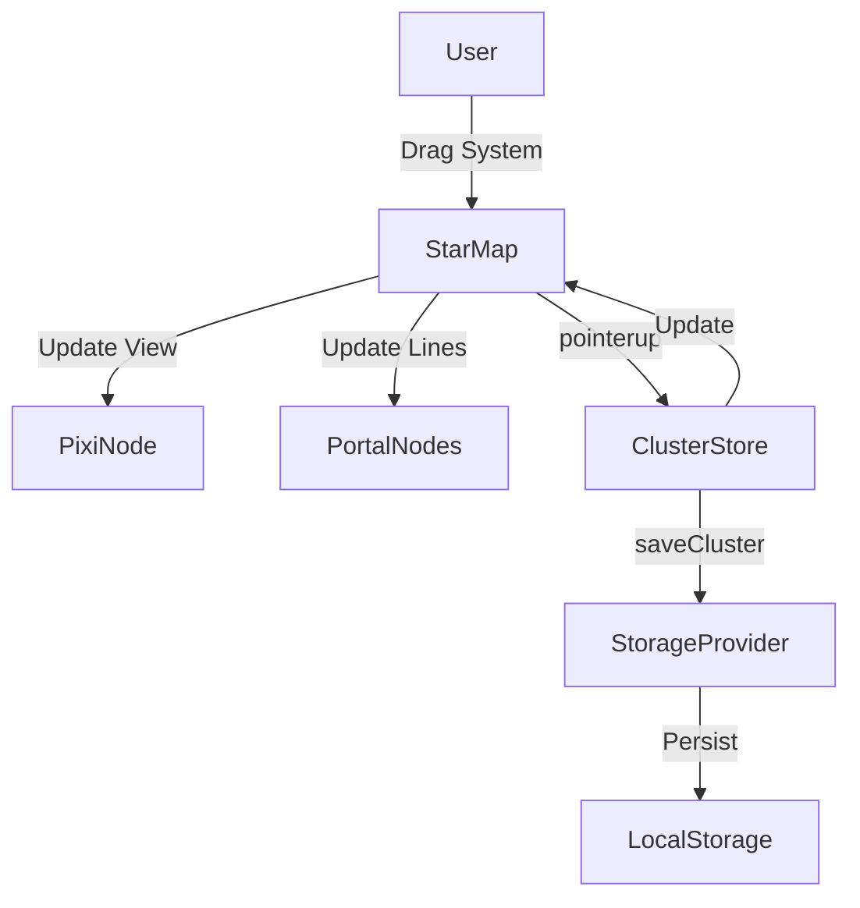

# Requirements

### Overview & Goals
Allow users to rearrange solar systems within a cluster by dragging them on the Star Map. This provides an intuitive way to customize the cluster layout.

### Scope
- **In Scope**:
    - Real-time dragging of solar system nodes in `StarMap.svelte`.
    - Real-time updating of connecting portals during drag.
    - Persisting the new coordinates (`X`, `Y`) of the solar system to storage.
    - UI feedback during drag (cursor change).
    - Documentation of the feature in the Help overlay.
    - Automated E2E testing for the drag-and-drop functionality.
- **Out of Scope**:
    - Rearranging the order of systems in a list view (not requested/not intuitive for spatial layout).
    - Snapping to grid (unless requested later).
    - Multi-select dragging.

# Technical Design

### Current Implementation
- `StarMap.svelte` uses PIXI.js and `pixi-viewport` to render the cluster.
- Solar systems are represented by `PIXI.Graphics` nodes.
- Portals are rendered as lines between systems.
- Data is stored in the `$cluster` store and persisted via `saveCluster`.

### Proposed Changes
#### Interaction Logic in `StarMap.svelte`
- **Drag Start (`pointerdown` on system node)**:
    - Set `isDragging = true`.
    - Store the `draggedSystemId`.
    - Pause `viewport.plugins.pause('drag')` to prevent map panning.
    - Set `node.cursor = 'grabbing'`.
- **Drag Move (`pointermove` on viewport)**:
    - Calculate new world coordinates using `viewport.toWorld(e.global)`.
    - Update the PIXI node's `x` and `y`.
    - Update `fromPos` or `toPos` in `portalNodes` for all portals connected to the dragged system.
    - Call `drawPortals()` to refresh the lines.
- **Drag End (`pointerup`/`pointerupoutside` on viewport)**:
    - Update the system's `X` and `Y` in the `$cluster` data.
    - Call `saveCluster()` to persist changes.
    - Resume `viewport.plugins.resume('drag')`.
    - Reset drag state and cursor.

#### UI Updates
- **`HelpOverlay.svelte`**: Add "Drag System" to the list of available interactions.

### Architecture Diagram

### Risks
- **Performance**: Redrawing all portals on every move might be expensive if there are many portals. However, `drawPortals` is already optimized to use current scales and highlights.
- **Bounds**: Dragging a system outside current viewport clamps might require refreshing the clamps. `renderCluster` (called after save) already handles this.

# Testing

### Validation Approach
I will verify the functionality by adding unit tests for the interaction setup and automated E2E tests for the full drag-and-drop flow.

### Key Scenarios
1. **Move System**: Drag a system to a new location, verify portals follow, and check that it stays there after reload.
2. **Conflict with Panning**: Ensure that dragging a system does not move the entire map at the same time.
3. **Cancel Drag**: Ensure that if the pointer is released outside the viewport, the state is still cleaned up.

### E2E Testing Details
- **Test File**: `apps/web-e2e/tests/system-rearrangement.spec.ts`.
- **Flow**:
    1. Load the app with a fixture cluster.
    2. Get the initial coordinates of a system from the store.
    3. Use Playwright's `mouse.move`, `down`, and `up` to simulate dragging the system node.
    4. Since PIXI nodes are not in the DOM, use `starMapDebug` to translate system world coordinates to screen coordinates.
    5. Verify that the system's coordinates in the store have updated after the drag.
    6. Reload the page and verify the system remains at the new coordinates.

# Delivery Steps

### ✓ Step 1: Implement drag-and-drop initialization in StarMap
Enable interaction on solar system nodes in the Star Map and implement drag state management.

- Add `isDragging` and `draggedSystemId` state to `StarMap.svelte`.
- Update `createSystems()` to handle `pointerdown` for starting a drag.
- Pause viewport panning when dragging starts to avoid conflicts.
- Change cursor to `grabbing` during drag.

### ✓ Step 2: Implement real-time drag updates for systems and portals
Update the positions of systems and connecting portals in real-time as the user drags a system.

- Add a `pointermove` listener to the viewport in `StarMap.svelte`.
- Update the dragged PIXI node's coordinates based on the pointer's world position.
- Identify and update the endpoints of all portals connected to the dragged system in `portalNodes`.
- Trigger a redraw of the portals during the drag for visual feedback.

### ✓ Step 3: Finalize drag and persist changes
Save the new coordinates to the cluster storage and refresh the application state.

- Implement `pointerup` and `pointerupoutside` handlers to finalize the drag.
- Update the solar system's `X` and `Y` coordinates in a clone of the `$cluster` store.
- Call `saveCluster()` to persist the changes.
- Resume viewport panning and clear drag state.
- Add a new shortcut to `HelpOverlay.svelte` to inform users about the drag feature.

### ✓ Step 4: Verify with unit tests
Verify the new functionality with unit tests.

- Add test cases to `StarMap.test.ts` to ensure system nodes are interactive.
- Verify that `pointerdown` on a system node triggers the expected state changes (mocks).

### ✓ Step 5: Implement E2E tests
Add automated E2E tests to verify the feature in a real browser.

- Create `apps/web-e2e/tests/system-rearrangement.spec.ts`.
- Implement a test case that drags a system and verifies persistence.
- Ensure the test handles coordinate translation from world space to screen space using `starMapDebug`.
- Run `npm run e2e:web` to verify the tests pass.