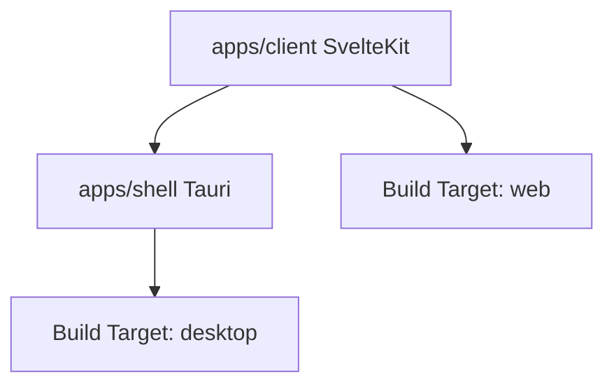

# Requirements

### Overview & Goals
The goal is to clarify the project structure by separating "apps" (the source code modules) from "targets" (the distribution formats). Currently, `apps/web` and `apps/desktop` are named after their targets, which is confusing when the same code might contribute to multiple targets or when a target involves multiple apps.

### Scope
- **In Scope**:
  - Renaming `apps/web` to `apps/client` (the SvelteKit frontend).
  - Renaming `apps/desktop` to `apps/shell` (the Tauri desktop wrapper).
  - Updating all internal and external references to these packages.
  - Clarifying build targets in the root `package.json`.
  - Improving E2E tests to run against both `web` and `desktop` targets with automatic environment setup.
- **Out of Scope**:
  - Changing the actual business logic or UI of the apps.
  - Adding new platforms (e.g., mobile).
  - Modifying `libs/procedural-gen` except for path references.

### User Stories
- As a developer, I want to clearly distinguish between the client source code and the desktop shell code.
- As a developer, I want to run E2E tests on both web and desktop targets with a single command.
- As a developer, I want the E2E test environment to be automatically set up (e.g., starting the web server).

# Technical Design

### Current Implementation
- `apps/web`: SvelteKit app, named `horizonis-web`.
- `apps/desktop`: Tauri app, named `horizonis-desktop`, depends on `horizonis-web` build.
- Root scripts use `web:*` and `desktop:*` prefixes.
- E2E tests in `apps/e2e-tests` default to desktop and require a manual `TARGET=web` to switch.

### Proposed Changes
#### 1. Directory & Package Renaming
 Old Path | New Path | Old Package Name | New Package Name |
---|---|---|---|
 `apps/web` | `apps/client` | `horizonis-web` | `horizonis-client` |
 `apps/desktop` | `apps/shell` | `horizonis-desktop` | `horizonis-shell` |

#### 2. Root Scripts (Refined Naming)
The new scripts follow the `<command>:<target>` pattern:
- `dev:web` / `dev:desktop`
- `build:web` / `build:desktop`
- `e2e:web` / `e2e:desktop`
- `e2e` (runs both)

#### 3. E2E Test Enhancements
- **Auto-Server**: For `web` target, `wdio.conf.js` will check if a server is running on port 1420 and start one (via `pnpm build:web && pnpm preview:web`) if it's not.
- **Binary Path**: Update `wdio.conf.js` to point to `target/debug/horizonis-shell` (matching the new crate name).

### File Structure
```text
apps/
  client/ (was web)
    package.json (horizonis-client)
    project.json
  shell/ (was desktop)
    package.json (horizonis-shell)
    project.json
    Cargo.toml (horizonis-shell)
    tauri.conf.json
  e2e-tests/
    wdio.conf.js
```

### Architecture Diagram


# Testing

### Validation Approach
Verification will be done by running the build and e2e scripts for both targets.

### Key Scenarios
1. **Web Build & Dev**:
   - `pnpm build:web` should produce a build in `apps/client/build`.
   - `pnpm dev:web` should start the SvelteKit dev server.
2. **Desktop Build & Dev**:
   - `pnpm build:desktop` should build the client and then the Tauri binary.
   - `pnpm dev:desktop` should start the Tauri dev environment.
3. **E2E Tests**:
   - `pnpm e2e:web` should start a server and run tests in Firefox (headless).
   - `pnpm e2e:desktop` should build/verify the binary and run tests in the Tauri shell.
   - `pnpm e2e` should run both sequentially and pass.

### Edge Cases
- **Server already running**: E2E web target should detect if port 1420 is busy and either use it or report an error.
- **Build failures**: `build:desktop` should fail if `build:web` fails.

# Delivery Steps

### ✓ Step 1: Rename apps and update metadata
Rename the app directories to reflect their role rather than their build target.
- Move `apps/web` to `apps/client`.
- Move `apps/desktop` to `apps/shell`.
- Update `package.json` names: `horizonis-web` -> `horizonis-client`, `horizonis-desktop` -> `horizonis-shell`.
- Update `project.json` names and paths in both directories.
- Update root `Cargo.toml` and `apps/shell/Cargo.toml`.
- Update `tauri.conf.json` in `apps/shell` to point to the new client paths and update build commands.
- Update `pnpm-workspace.yaml` if needed (it uses `apps/*` so it should be fine, but I will check).

### ✓ Step 2: Clarify build targets in root configuration
Update root scripts and Nx configuration to reflect the new structure and clarify build targets.
- Update root `package.json` scripts:
  - `web:dev` -> `dev:web`
  - `web:build` -> `build:web`
  - `desktop:dev` -> `dev:desktop`
  - `desktop:build` -> `build:desktop`
  - `e2e` -> runs both web and desktop targets sequentially.
- Add specific e2e scripts: `e2e:web`, `e2e:desktop`.
- Update Nx project names in scripts.

### ✓ Step 3: Enhance E2E tests for dual-target execution
Improve the E2E test suite to support both web and desktop targets with automatic server management.
- Update `apps/e2e-tests/wdio.conf.js` to handle `TARGET=web` and `TARGET=desktop`.
- Implement auto-starting of the web server for the web target in `onPrepare`.
- Update the desktop binary path in `wdio.conf.js` to match the new shell package name.
- Add a `preview` target to `apps/client/project.json` to facilitate E2E testing.